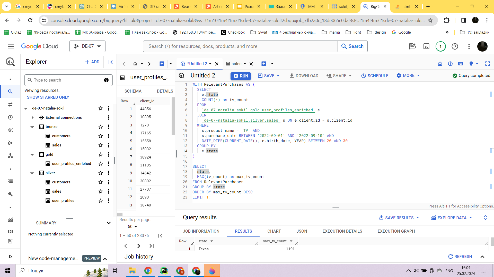
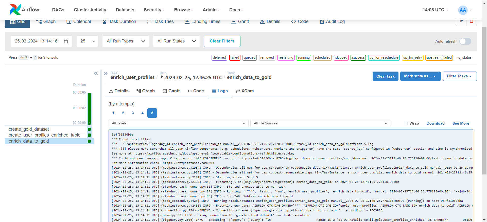

In this project you will find pipelines to load data from Google Storage to Google Big Query by using Apache Airflow

All dags are in folder dags
The result data in GBQ looks like:

The answer on the question is Taxes 1191

The example of dag processing:
